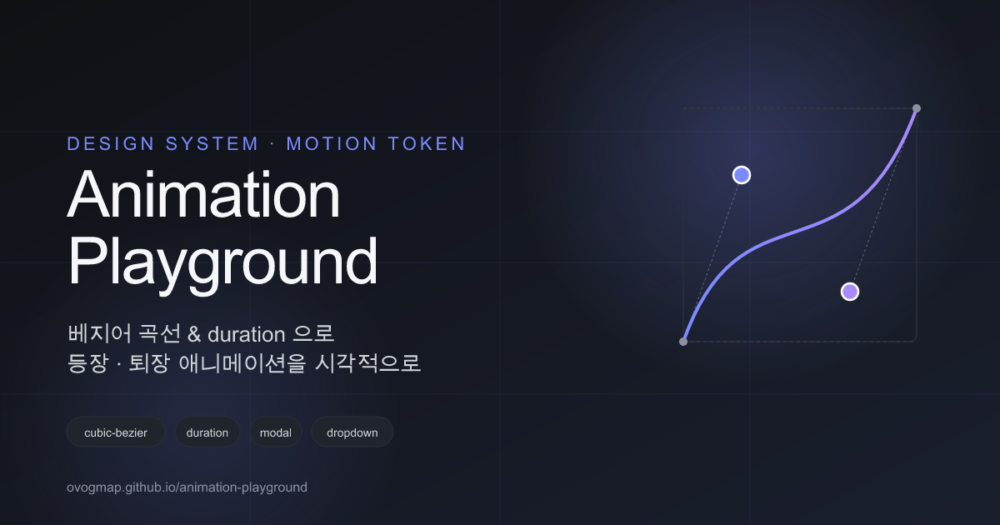

# Animation Playground

베지어 곡선과 duration 을 시각적으로 조절하며, 모달 · 드롭다운 · 토스트 · 사이드패널의 등장 · 퇴장 애니메이션을 실시간으로 테스트하고 CSS 를 바로 복사할 수 있는 도구입니다.



**🔗 라이브 데모 → [ovogmap.github.io/animation-playground](https://ovogmap.github.io/animation-playground/)**

---

## 이런 분에게 추천해요

- 베지어 곡선 (`cubic-bezier`) 에 익숙하지 않지만, 애니메이션 감각을 잡고 싶은 **디자이너**
- 디자인 시스템의 **모션 토큰** (easing, duration) 을 정규화하려는 팀
- 숫자만 보고는 "이 곡선이 어떤 느낌인지" 가늠하기 어려웠던 모든 분

숫자를 외울 필요 없이 **핸들을 드래그하고, 프리셋을 눌러보고, 컴포넌트가 실제로 어떻게 움직이는지 눈으로 보면서** 원하는 값을 찾아갑니다.

---

## 핵심 기능

### 🎯 시각적인 베지어 편집
- SVG 그래프 위 **2개의 핸들을 드래그**해 곡선을 직접 조작
- `linear`, `ease`, `ease-in`, `ease-out`, `ease-in-out`, `Material`, `iOS`, `overshoot` 등 **8개 프리셋** 원클릭 적용
- 현재 값을 `cubic-bezier(...)` 형식으로 실시간 표시

### ⏱ Enter / Exit 분리 설정
등장과 퇴장은 서로 다른 모션이 자연스러워요. 두 단계를 **각각 독립적으로** 설정합니다.
- Enter: `ease-out` 계열 + 빠른 duration
- Exit: `ease-in` 계열 + 더 빠른 duration

### 🧩 4개의 기본 컴포넌트 미리보기
실제 UI 패턴으로 테스트해 추상적인 곡선이 아닌 **체감되는 모션**을 확인합니다.
- **Modal** — scale + opacity (가운데 등장)
- **Dropdown** — translateY + opacity (위에서 펼침)
- **Toast** — translateX + opacity (오른쪽에서 슬라이드)
- **Sidepanel** — translateX (우측 전체 슬라이드)

### 📋 CSS 한 번에 복사
원하는 값을 잡았다면, 생성된 CSS 를 **Copy 버튼 한 번**으로 클립보드에 복사 → 디자인 시스템 토큰이나 코드에 바로 붙여넣기.

```css
.modal-enter {
  transition: transform 240ms cubic-bezier(0, 0, 0.2, 1),
              opacity 240ms cubic-bezier(0, 0, 0.2, 1);
}
.modal-exit {
  transition: transform 180ms cubic-bezier(0.4, 0, 1, 1),
              opacity 180ms cubic-bezier(0.4, 0, 1, 1);
}
```

---

## 사용 방법

1. 상단 탭에서 테스트할 컴포넌트 선택 (Modal / Dropdown / Toast / Sidepanel)
2. **Enter** 섹션에서 핸들을 드래그하거나 프리셋 클릭, duration 조절
3. **Exit** 섹션에서도 동일하게 설정
4. 우측 미리보기 영역의 **Open / Close / Toggle** 버튼으로 모션 재생
5. 마음에 들면 **CSS Output → Copy** 버튼으로 복사

각 컴포넌트의 설정은 탭을 전환해도 유지됩니다. 초기화하려면 **Reset to defaults** 버튼을 누르세요.

---

## 로컬에서 실행하기

```bash
git clone https://github.com/ovogmap/animation-playground.git
cd animation-playground
npm install
npm run dev
```

브라우저에서 `http://localhost:5173` 접속.

### 빌드
```bash
npm run build
```

---

## 기술 스택

- [Vite](https://vitejs.dev/) + [React 19](https://react.dev/) + TypeScript
- 순수 CSS transition + `cubic-bezier` (애니메이션 라이브러리 미사용)
- 베지어 그래프는 SVG 로 직접 구현 (외부 의존성 없음)
- GitHub Actions + GitHub Pages 자동 배포

---

## 기여

버그 제보 · 기능 제안 · PR 모두 환영합니다.
[이슈 등록하기](https://github.com/ovogmap/animation-playground/issues)
